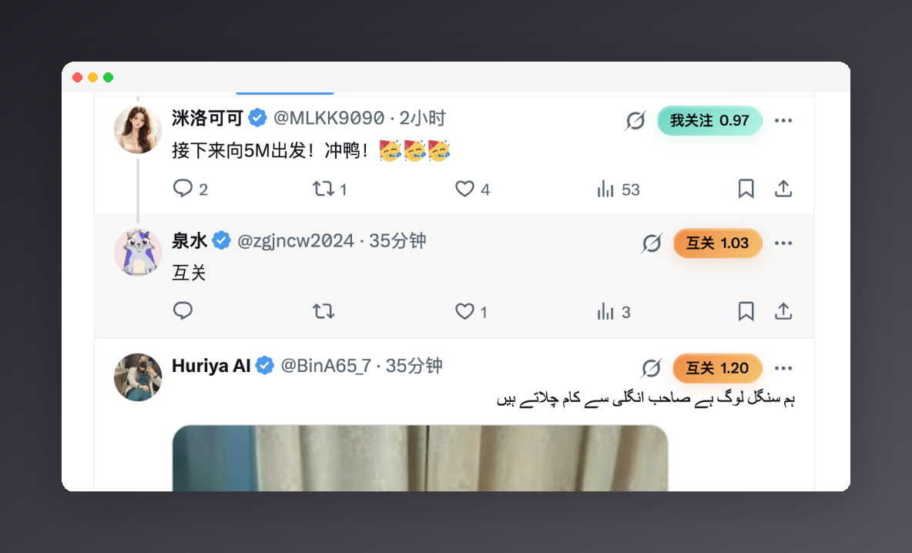
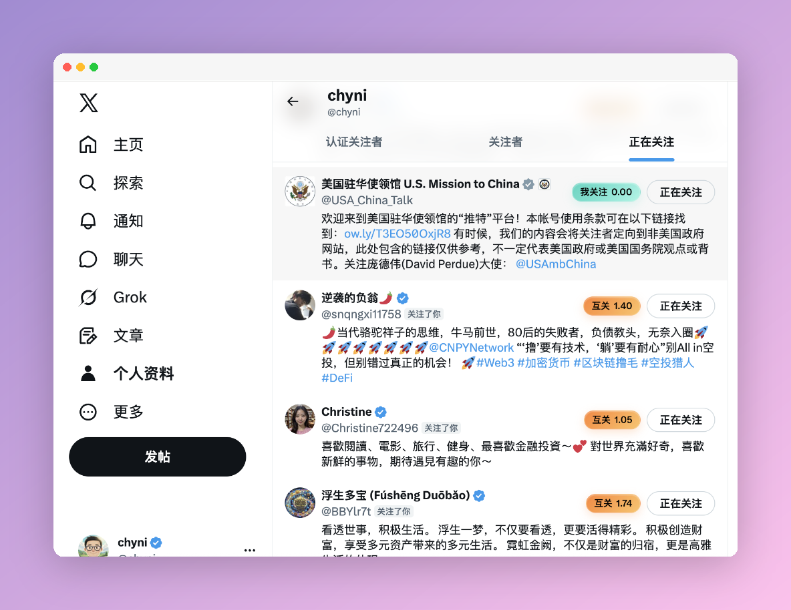
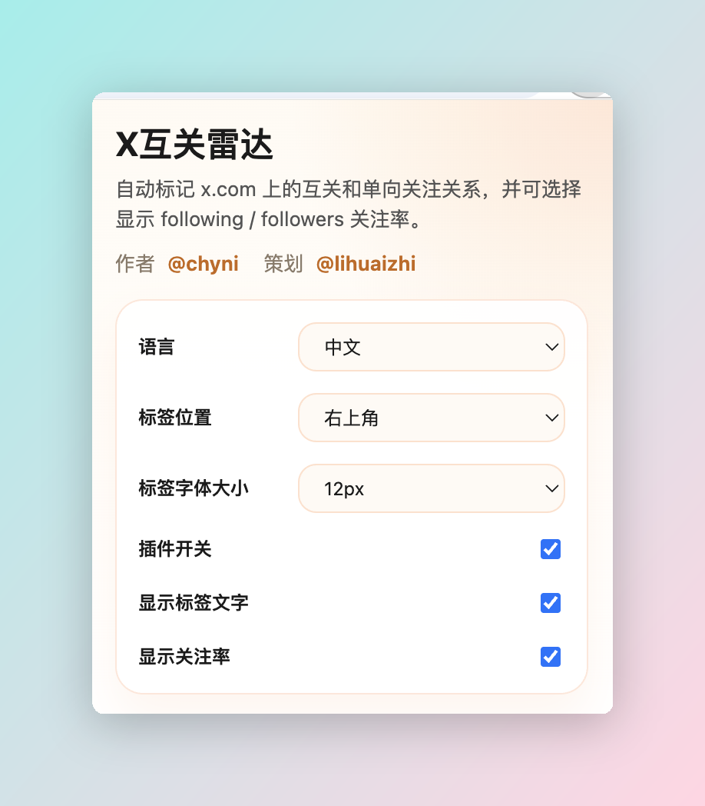

# X 互关雷达：打破社交迷雾，一眼掌控 X 关系网络

*让社交决策更加精准，让互关更有温度。*

## 🌟 为什么你需要 X 互关雷达？

在 X (原 Twitter) 的海洋中，社交关系往往显得琐碎而繁杂。打开一个博主的主页，你可能需要经过多步操作才能确认：
- “他关注了我吗？”
- “我们互关了吗？”
- “他的关注率（Following/Followers Ratio）是多少？”

**X 互关雷达 (X Mutual Radar)** 专为解决这些痛点而生。它像一个置于浏览器中的“社交透视镜”，通过极简的 UI 注入，在不破坏原生美感的前提下，实时为你标注每一层社交关系。

---

## 🚀 核心功能亮点

### 1. 实时关系标注 (Smart Badging)
在任何个人主页、帖子流或侧边栏，插件会自动为你贴上专属“关系标签”：
- **橙色 [互相关注]**：社交圈中的“老熟人”，关系更稳固。
- **青色 [我关注]**：正在探索的精彩账号。
- **蓝色 [关注我]**：对你感兴趣的潜在好友。

### 2. 关注率即刻洞察 (Follow Rate)
独家支持 **Following / Followers 关注率** 展示。只需看一眼百分比，就能快速识别对方是“社交达人”、“高质量博主”还是“回关机器”，极大地辅助你的社交过滤效率。

### 3. 轻量化与隐私保护 (Privacy First)
- **本地扫描**：仅基于页面已有的公开信息，不请求第三方 API，不消耗额外流量。
- **隐私至上**：你的社交关系数据永远留在本地，我们不采集、不上传、不追踪。

### 4. 彻底的开源免费 (Open Source & Free)
完全开源且永久免费。代码公开透明，没有任何隐藏收费，无论是日常使用还是技术学习，让您放宽心。
- **Manifest V3**：基于 Chrome 最新标准开发，性能卓越，安全可靠。

---

## 📸 真实运行截图

*无缝集成：不仅是列表，首页信息流也能自动检测每个发帖人的关系，丝滑融入 X 原生界面。*

*精准标记：在关注列表、粉丝列表等界面自动显示关系标签，快速识别“互相关注”、“单向关注”与关注率。*

*丰富且直观的设置面板：支持切换语言、定制标签外观以及开关各项功能。*

---

## 🛠️ 三步开启你的 X 社交“上帝视角”

1. **安装扩展**：加载本项目 unpacked 文件夹或从应用商店下载。
2. **个性化配置**：点击插件图标，自由设定标签字号、位置及显示内容。
3. **即刻使用**：刷新 x.com，感受丝滑、直观的社交关系标记。

### 💡 极简主义设计
与原生 X 界面完美契合。你可以关闭标签文字，仅显示彩色圆点，保持界面的极致纯净。

---

> 🔗 **立即尝试**，用 **X 互关雷达** 重塑你的 X 社交体验！
>
> *本扩展由 @chyni 开发，@lihuaizhi 策划，持续迭代中...*
